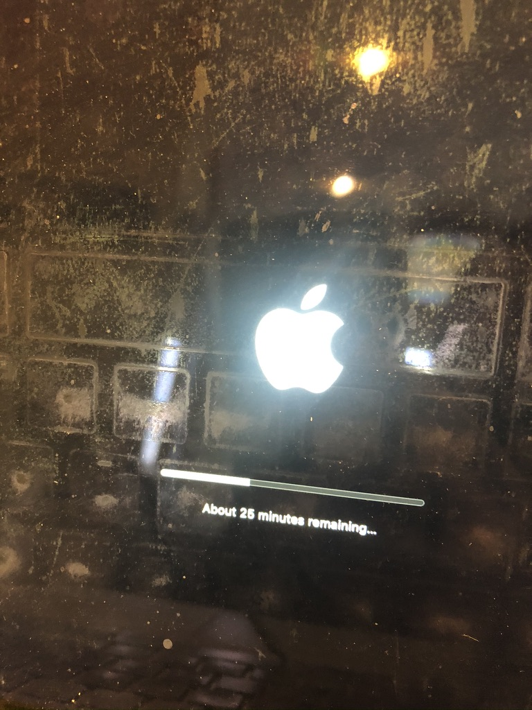
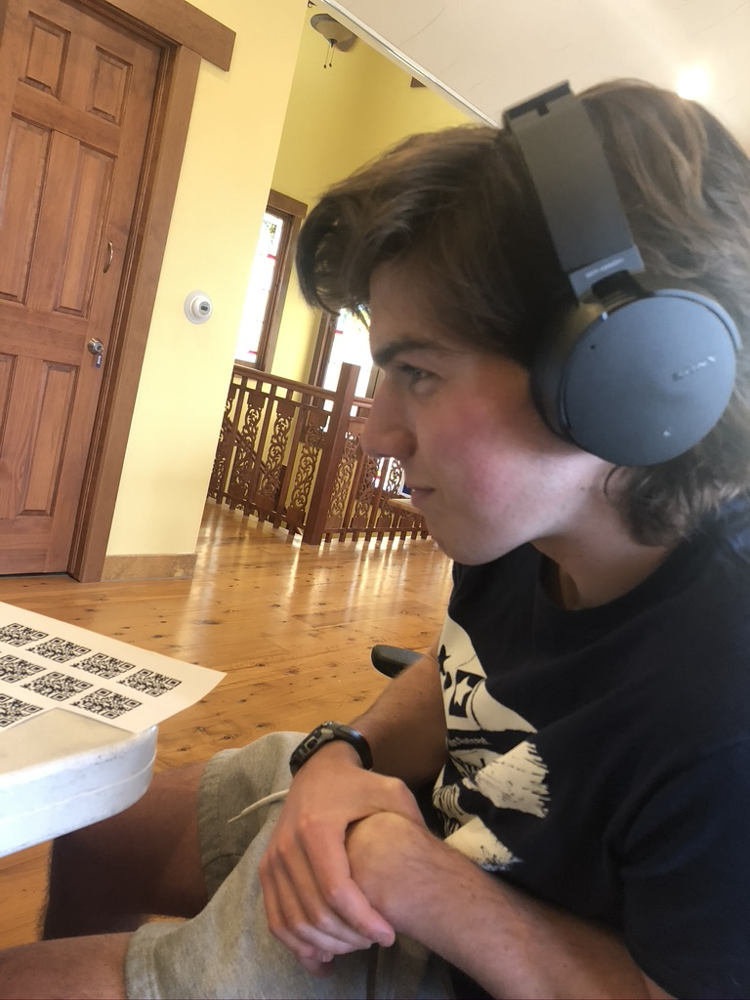
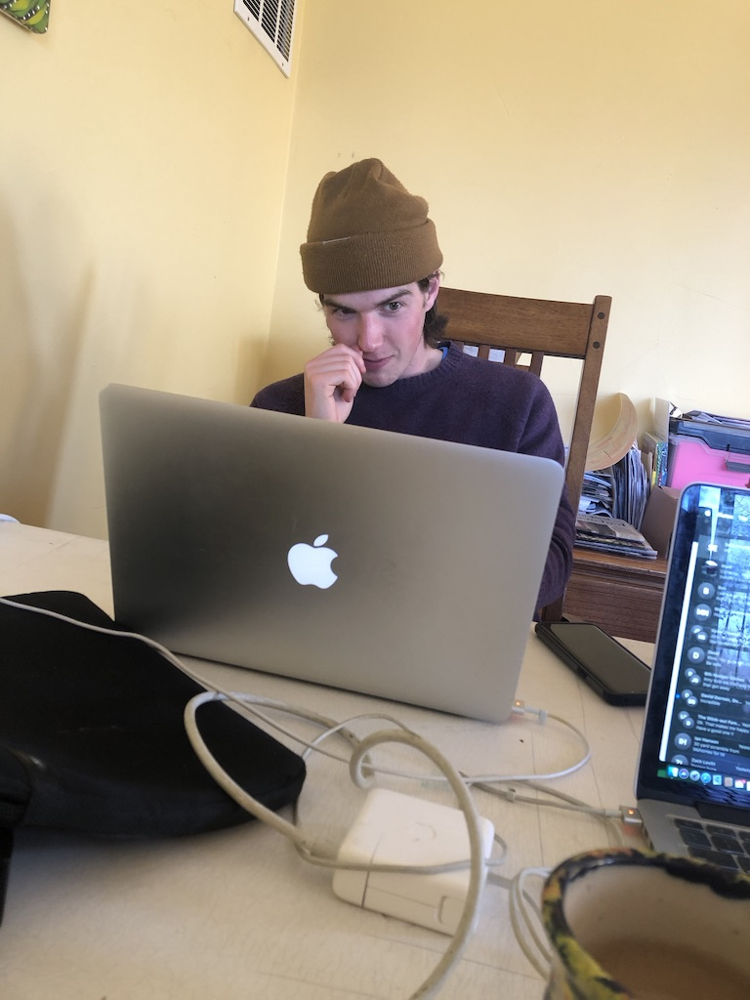
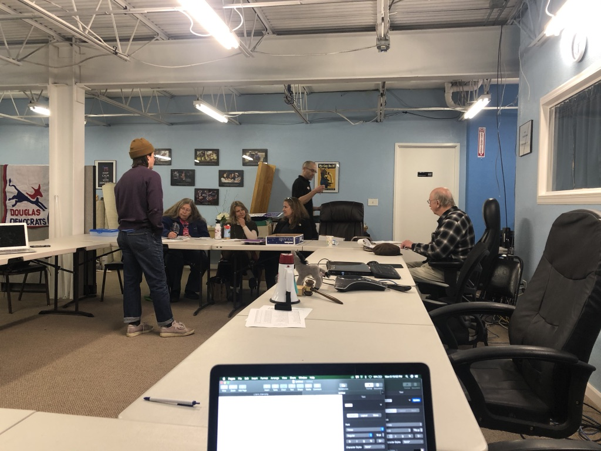
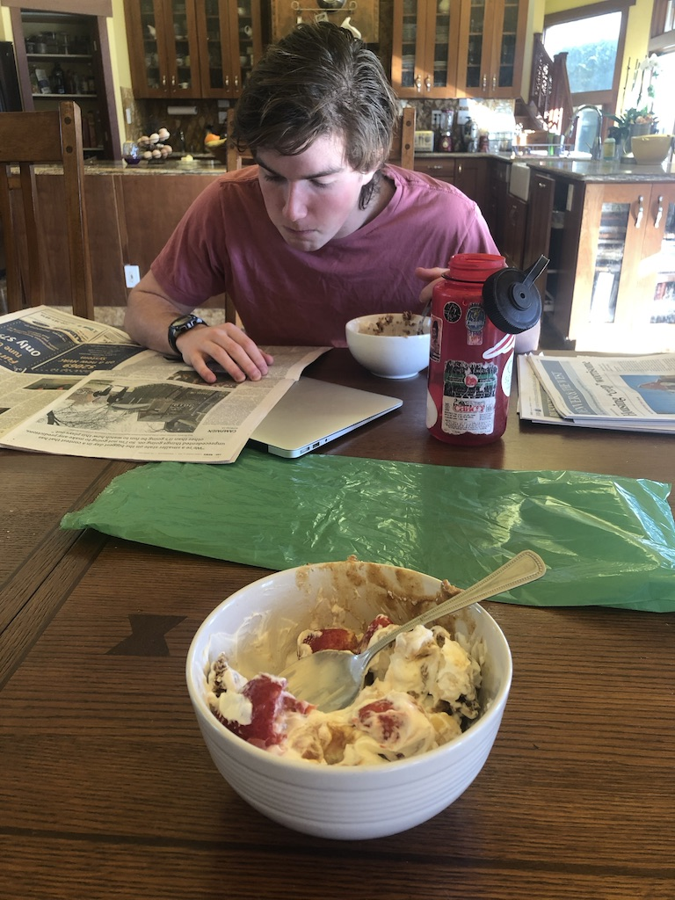
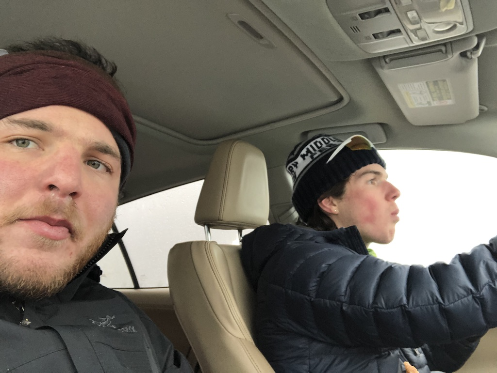

## January 21, 2020

Today is the day we can start collecting petitions!!!

Unfortunatley, my computer decided it needed a break:

But that didn't dampen spirits.

Will working on a petition signature training video!

Will and I made this training video to circulate to volunteers. This 8 minute video allows people to be trained right from their computer or phone. Making people attend an in person training event was a big barrier for people agreeing to help. If you include time it takes to travel to and from the training event, and all of the questions people ask at the event, it takes up to 2 hours to attend one of these events. The video will substantially decrease the barrier for people to help the campaign.

Here is the video: 

## January 20, 2020

In the evening, we hosted a petition signature training at the Douglas County Democrat office.

Here is Will presenting! Look at captivating he is.

## January 16, 2020

## January 15, 2020

Today, we went to the Colorado's Secretary of State's office and learned how to properly collect petitions for candidates.

## January 14, 2020

## January 13, 2020

Fueling up for the big day with some delicious and nutritious breakfast bowls!

Today, I added training events to Diana's facebook page. People who collect signatures must be trained before they can collect signatures. There are specific rules petition circulators must follow in order for a their signatures to be considered valid. Additionally, I designed the email for Diana to send out to her mass email list looking for volunteers and donation. 

Here is the [email](mailerlite1.pdf)

## January 11, 2020

Will and I took our day off to hit the slopes!

## January 10, 2020

The google drive and the organization of the google drive is crucial to the campaign's success. It stores all the information for contact leads, endorsement, social media information, etc. 

Unfortunatley, our campaign is the least well funded in the race. As a result, we do not have the money to spend on organizational tools or strategy tools. Intead, we have to use open source softwares and things like google drive to organize all of our information. It is integral that everybody is on the same page about the organization of the google drive and how it functions. If this is not the case, it is really easy to clutter the google drive and drastically decrease the campaign's efficiency. 

Diana has more and more interns joining the campaign, and Will and I are going to leave January 31st. This means we have to leave the campaign set up for success. We must set up a system that functions because the system is well set-up, not because Will and I are here to facilitate it. The drive needs to be set-up so that anyone new who joins the campaign does not need to first learn how it works in order for it to be effective. It needs to be inuitive.

Before Will and I came to work for her, Diana had several different groups work for her. Additionally, her campaign manager is someone who does not have a lot of experience with computers or google drive. Thus, the google drive was disorganized and not very functionable.

| Before      | After |
| ----------- | ----------- |
| **Photos** 
Pictures are important for social media and advertising. They're more effective at engaging potential voters than words.  Pictures were divided into events. There was a folder for each event at which a picture was taken. **Why it was bad** When posting on social media, you need a specific photo of Diana either by herself or giving a speech or posing with a group of people. It took a really long time to find each one.     | **Change**  The folders are now organized into "Diana alone", "Diana speaking", etc. Now, it is way easier to find a photo when trying to make a post or advertisement product.      |
| **Contacting people and organizations**
| Contacting people and organizations is integral to a successful campaign– especially when there is low name recognition throughout the state. That places all of the burden on the campaign to reach out to groups and people to ask for support. Additionally, it is important to capitalize on the people that are willing to help with the campaign. **why it was bad*** The google drive had so many different google sheets with varying types of contact information. Because there were so many different files for people that were willing to volunteer vs. people who were willing to support vs. people who had said they would volunteer but were never contacted again, it was easy for so many people to slip through the cracks.    | **Change** I merged all the lists so there were no redundancies, and it was clear who had been contacted, who needs to be followed up, and who is not likely to support. Additionally, it standardized the information needed for each contact.        |

In addition to organizing the drive, Diana, Will, and I met with Arend Richard, a social media influencer, founder of [The Weed Tube](https://www.theweedtube.com/), and endorser of Diana. He was willing to host an event and create a video all in support of Diana. This was a huge meeting for the campaign because it could lead to a lot of visibility for Diana, something that's crucial to get the 1,500 valid signatures we need to get her on the ballet. 

## January 9, 2020

We began our day by removing the bed that was in campaign HQ in order to create more spaces to work. 

Here is the new and improved campaign HQ!

Next, we drove with Diana to a climate march. At the march, people spoke about resisting oil companies and fracking. Speakers called on the Colorado legislature and governor to pass legislation regulating fracking and oil drilling.  30 people got arrested at the rally.

Here is a picture of Will and our fellow intern Maxine at the march!

After the march, we took Diana's petition ballots to the Secretary of State's office to ensure we had the proper format for the petition ballots we will use to collect the 1,500 signatures from each Congressional District Diana needs to get on the ballot.

Next, we organized the campaign's google drive and created a system that all volunteer and event outreach will use to bookkeep what events they've found where Diana could petition and what groups can the team contact to ask for volunteers.

## January 8, 2020

We began the day by going to what we thought was a climate march at the capital building at 10 am. Unfortunately, we got the date wrong and the climate march was the following day. Instead, we showed up to the freedom vs. force rally. The groups in attendence were: pro-choice, anti-vaxers, and second amendment right protectors. However, this mistake didn't stop us from seizing the day. We used this opportunity to get to know some anti-vaxers and to gather some advertising material.

Diana with anti-vaxers

Supa hot :fire: 

Then, I mapped where all of the registered democrats were clustered by precinct in congressional districts 2, 3, 4, and 5. Visit [Diana's volunteer website](https://dianaforcolorado.github.io/volunteer.github.io/) to see my final products. Our plan is to use those maps to target the areas where high density democrats are registered.

## January 7, 2020

Will and I started work at 10.

Here is campaign head quarters!

Around 5, we drove to staff Diana at a Democratic weekly meeting in the city of Aurora. There, Diana was one of two Senate candidates who spoke. 

Here she is speaking!

## January 6, 2020

We found out our goal is to get Diana on the ballot for the Democratic Senate Primary for Colorado. This entails collecting 1,500 signitures from each of Colorado's 7 districts. However, in order for a signature to count, it must be from somone who has been a registered Democrat for at least 30 days, and they cannot have signed another candidates petition who has already turned in their signatures. 

## January 5, 2020

Diana hosted a pizza party to kick off the new year. This was the first exposure Will and I had to her supporters. 

Diana speaking at her event 

Even the pizza pie master has to clean up around here

## January 1, 2020

Will and I leaving Topeka and heading to Denver!

