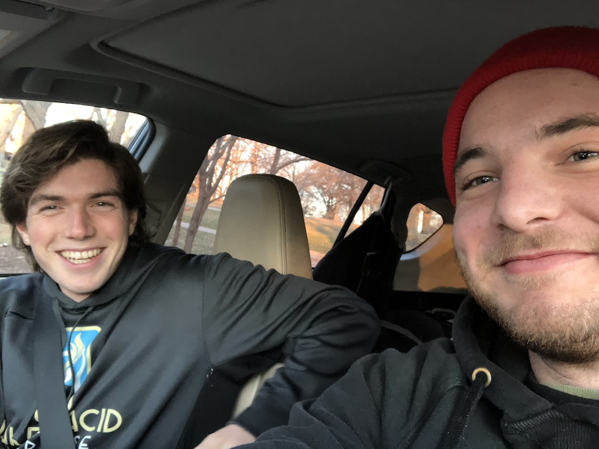
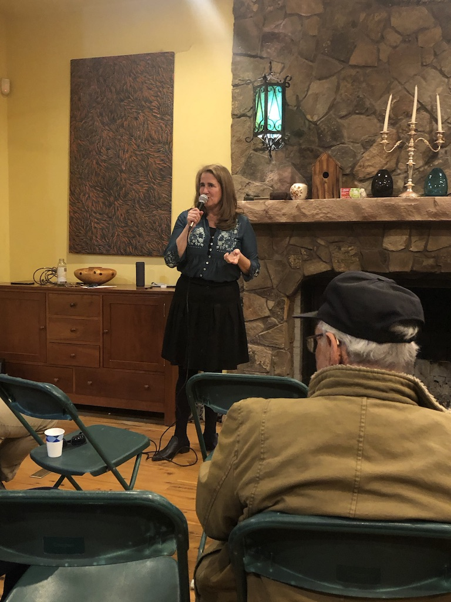
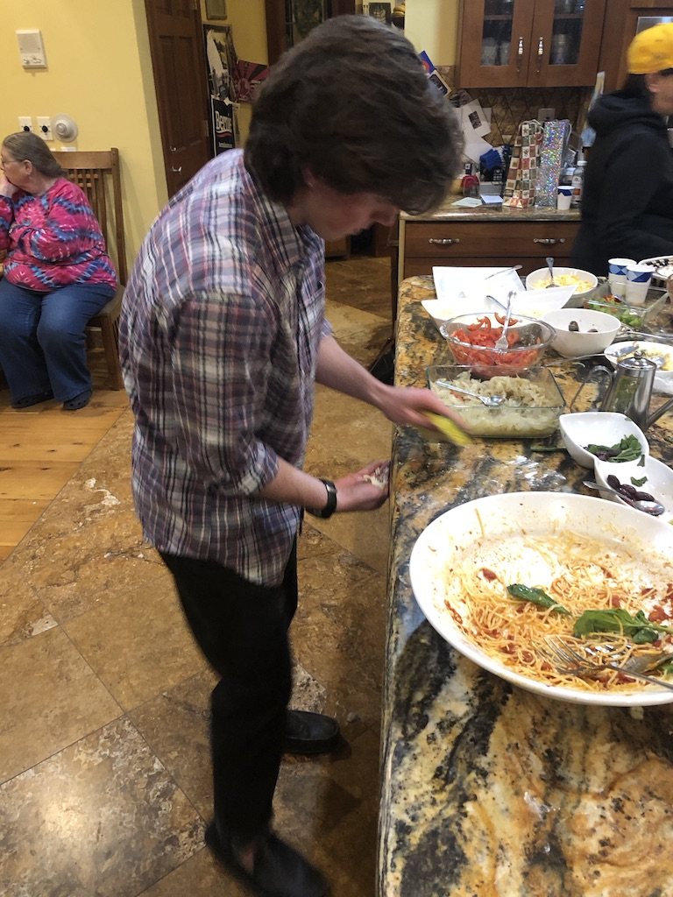
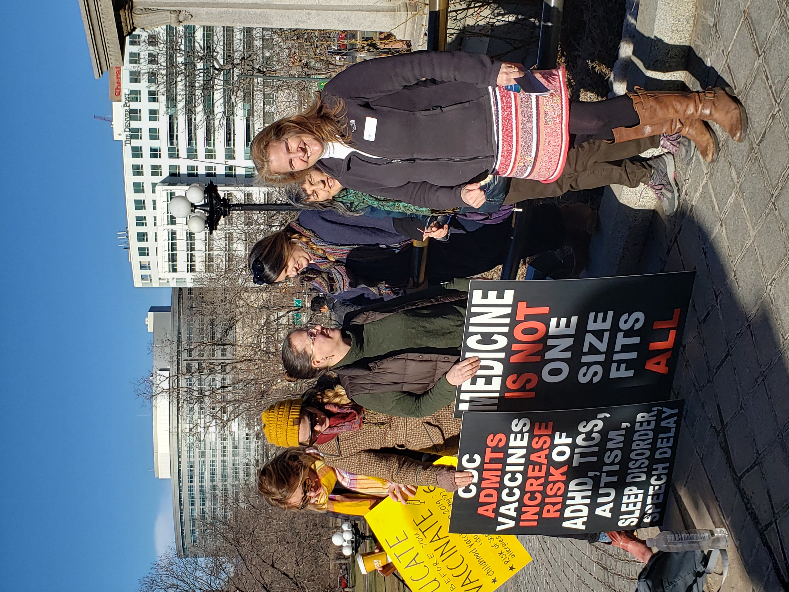

## January 1, 2020

Will and I leaving Topeka and heading to Denver!

## January 5, 2020

Diana hosted a pizza party to kick off the new year. This was the first exposure Will and I had to her supporters. 

Diana speaking at her event 

Even the pizza pie master has to clean up around here

## January 7, 2020

Will and I started work at 10

## January 8, 2020

We began the day by going to what we thought was a climate march at the capital building at 10 am. Unfortunately, we got the date wrong and the climate march was the following day. Instead, we showed up to the freedom vs. force rally. The groups in attendence were: pro-choice, anti-vaxers, and second amendment right protectors. However, this mistake didn't stop us from seizing the day. We used this opportunity to get to know some anti-vaxers and to gather some advertising material.

Diana with anti-vaxers

