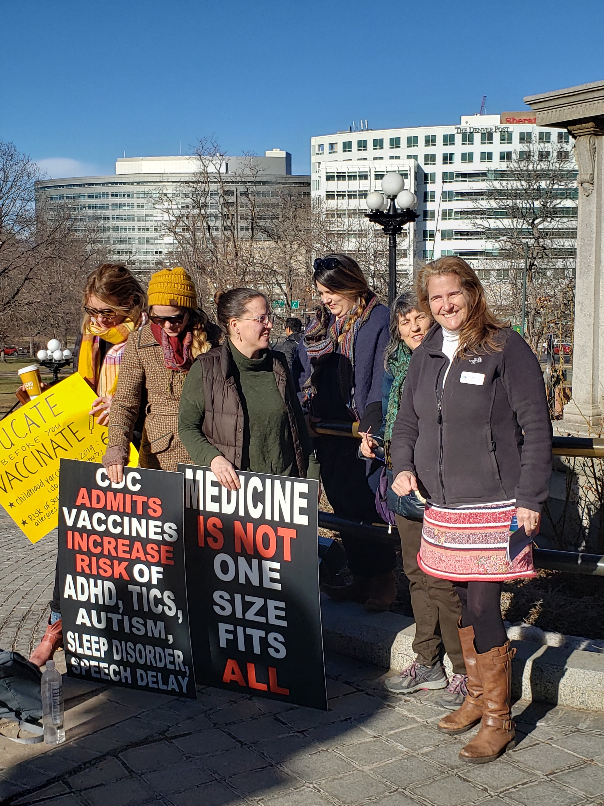

## January 10, 2020

The google drive and the organization of the google drive is crucial to the campaign's success. It stores all the information for contact leads, endorsement, social media information, etc. 

Unfortunatley, our campaign is the least well funded in the race. As a result, we do not have the money to spend on organizational tools or strategy tools. Intead, we have to use open source softwares and things like google drive to organize all of our information. It is integral that everybody is on the same page about the organization of the google drive and how it functions. If this is not the case, it is really easy to clutter the google drive and drastically decrease the campaign's efficiency. 

Diana has more and more interns joining the campaign, and Will and I are going to leave January 31st. This means we have to leave the campaign set up for success. We must set up a system that functions because the system is well set-up, not because Will and I are here to facilitate it. 

Before Will and I came to work for her, Diana had several different groups work for her. Additionally, her campaign manager is someone who does not have a lot of experience with computers or google drive. Thus, the google drive was disorganized and not very functionable.

| Syntax      | Description |
| ----------- | ----------- |
| Header      | Title       |
| Paragraph   | Text        |

## January 9, 2020

We began our day by removing the bed that was in campaign HQ in order to create more spaces to work. 

Here is the new and improved campaign HQ!

Next, we drove with Diana to a climate march. At the march, people spoke about resisting oil companies and fracking. Speakers called on the Colorado legislature and governor to pass legislation regulating fracking and oil drilling.  30 people got arrested at the rally.

Here is a picture of Will and our fellow intern Maxine at the march!

After the march, we took Diana's petition ballots to the Secretary of State's office to ensure we had the proper format for the petition ballots we will use to collect the 1,500 signatures from each Congressional District Diana needs to get on the ballot.

Next, we organized the campaign's google drive and created a system that all volunteer and event outreach will use to bookkeep what events they've found where Diana could petition and what groups can the team contact to ask for volunteers.

## January 8, 2020

We began the day by going to what we thought was a climate march at the capital building at 10 am. Unfortunately, we got the date wrong and the climate march was the following day. Instead, we showed up to the freedom vs. force rally. The groups in attendence were: pro-choice, anti-vaxers, and second amendment right protectors. However, this mistake didn't stop us from seizing the day. We used this opportunity to get to know some anti-vaxers and to gather some advertising material.

Diana with anti-vaxers

Supa hot :fire: 

Then, I mapped where all of the registered democrats were clustered by precinct in congressional districts 2, 3, 4, and 5. Visit [Diana's volunteer website](https://dianaforcolorado.github.io/volunteer.github.io/) to see my final products. Our plan is to use those maps to target the areas where high density democrats are registered.

## January 7, 2020

Will and I started work at 10.

Here is campaign head quarters!

Around 5, we drove to staff Diana at a Democratic weekly meeting in the city of Aurora. There, Diana was one of two Senate candidates who spoke. 

Here she is speaking!

## January 6, 2020

We found out our goal is to get Diana on the ballot for the Democratic Senate Primary for Colorado. This entails collecting 1,500 signitures from each of Colorado's 7 districts. However, in order for a signature to count, it must be from somone who has been a registered Democrat for at least 30 days, and they cannot have signed another candidates petition who has already turned in their signatures. 

## January 5, 2020

Diana hosted a pizza party to kick off the new year. This was the first exposure Will and I had to her supporters. 

Diana speaking at her event 

Even the pizza pie master has to clean up around here

## January 1, 2020

Will and I leaving Topeka and heading to Denver!

