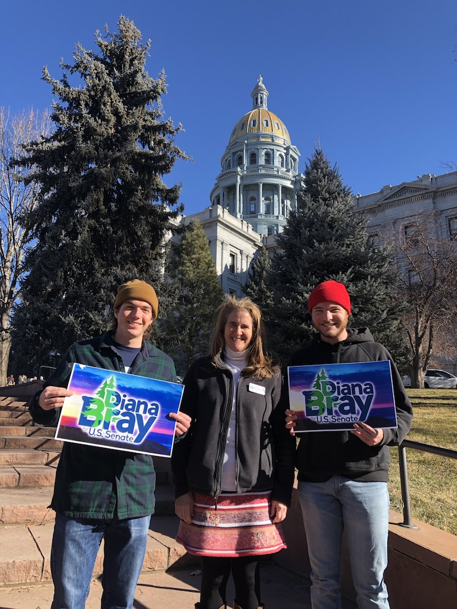

Hello! My name is Chris Gernon. I am studying Geography at Middlebury College in Vermont. During January of 2020, I worked on Diana Bray's Colorado US Senate Campaign. Diana was the most progressive candidate in the race. She had minimal funding, resources, and staff. The goal of the campaign was to get her on the ballot. This meant we had to collect 1,500 signatures from registered Democrats from each of Colorado's 7 congressional districts. 

[Daily Blog of What I Did](./blog/index.md)

[Portfolio](./porfolio/index.md)
